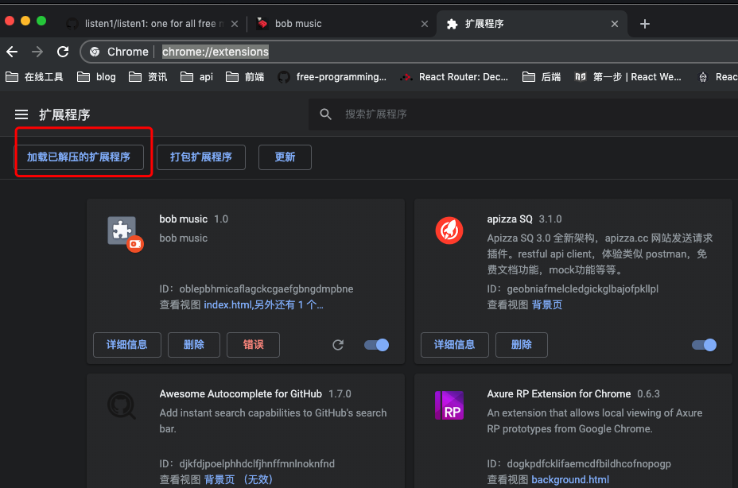
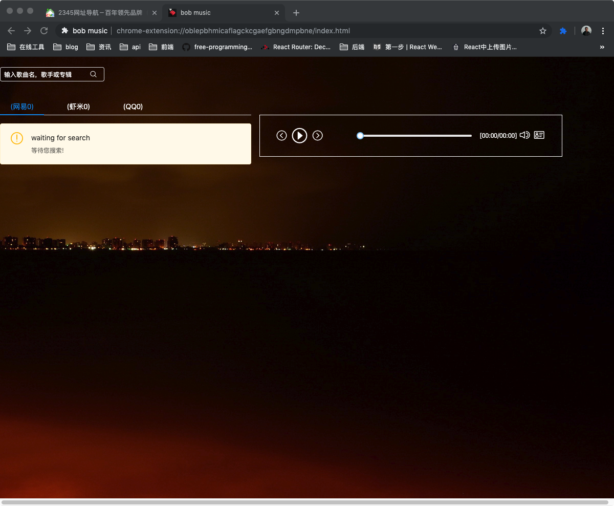
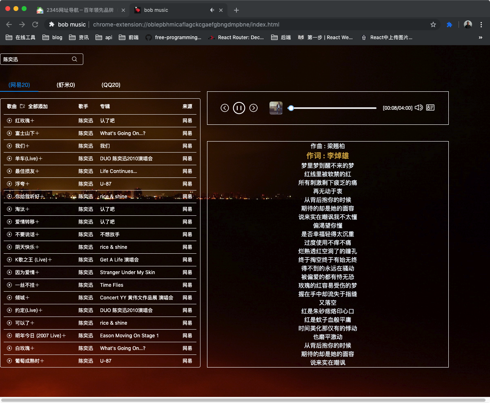

This project was bootstrapped with [Create React App](https://github.com/facebookincubator/create-react-app).

Below you will find some information on how to perform common tasks. 
You can find the most recent version of this guide [here](https://github.com/facebookincubator/create-react-app/blob/master/packages/react-scripts/template/README.md).

### 描述

bob_music 是一个 chrome 网页插件,使用方式是在 chrom 扩展程序 chrome://extensions/ 点击 **加载已解压的扩展程序** ,将本项目 build 目录 添加到目标中

相关截图如下

1. 
2. 
3. 

### 下载地址

1.  **windows 版本 ** [地址 bob_music-win32-x64.zip](https://github.com/czb128abc/bob_music/tree/master/buildApp/bob_music-win32-x64.zip)

2.  chrome 插件 [加载已解压目录 (./build) ](https://github.com/czb128abc/bob_music/blob/master/build)

### 参考项目

[https://github.com/listen1/listen1](https://github.com/listen1/listen1)
